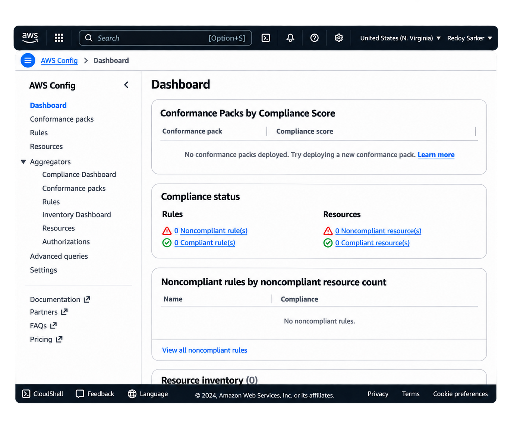
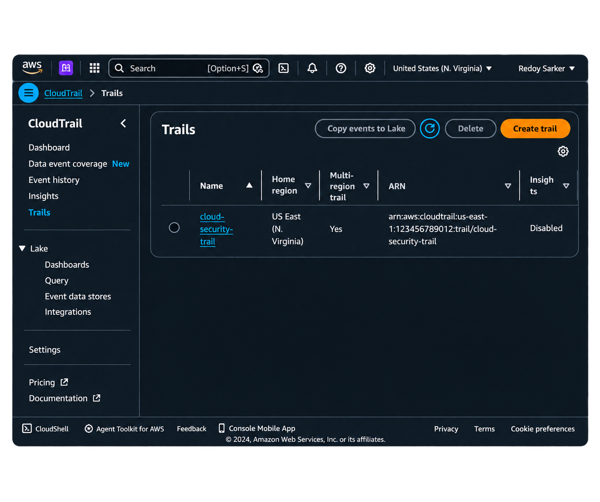
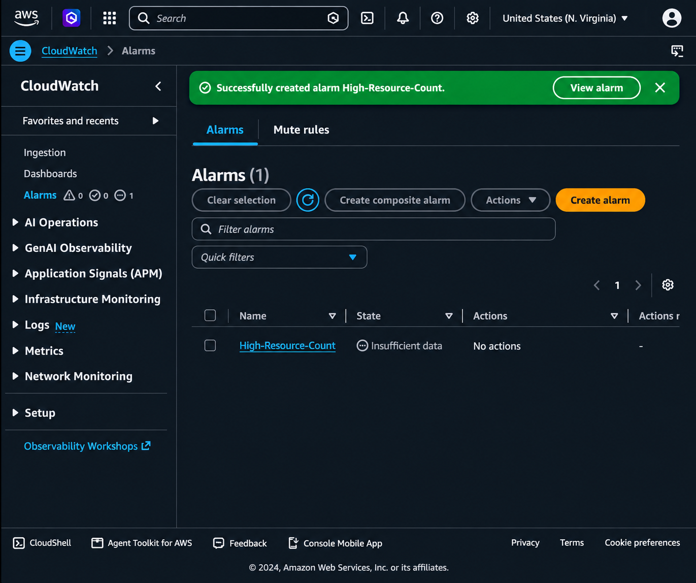

# Cloud GRC + NIST Cybersecurity Assessment

## Overview

I completed a basic security assessment of my personal AWS environment using the NIST Cybersecurity Framework (CSF) 2.0.

The goal of this project was to review my AWS cloud environment, identify security strengths and weaknesses, and recommend improvements based on industry best practices.

---

## Objectives

- Learn the NIST Cybersecurity Framework (CSF) 2.0
- Assess the security posture of an AWS account
- Identify security gaps
- Document security findings
- Recommend security improvements
- Gain hands-on experience with AWS security services

---

## Environment

- AWS Free Tier Account
- AWS IAM
- AWS Config
- AWS CloudTrail
- AWS CloudWatch
- IAM Access Analyzer
- GitHub

---

# Evidence

## AWS Config Dashboard

AWS Config was enabled to continuously record supported AWS resources and monitor configuration changes across the AWS environment. This provides visibility into resource configurations and supports compliance monitoring.

---

## AWS CloudTrail

AWS CloudTrail was configured with a multi-region trail to capture management events across the AWS account. CloudTrail provides an audit log of API activity that supports investigations, security monitoring, and compliance.

---

## Amazon CloudWatch Alarm

Amazon CloudWatch was configured with a custom alarm to monitor AWS resource metrics. The alarm demonstrates proactive monitoring by tracking resource activity and notifying administrators when predefined thresholds are exceeded.

**Purpose**
- Monitor AWS resources continuously
- Detect unusual activity
- Support operational visibility
- Improve incident detection
- Complement AWS Config and CloudTrail monitoring

---

# Assessment Scope

The following security controls were reviewed:

- Identity and Access Management (IAM)
- Multi-Factor Authentication (MFA)
- AWS Config
- AWS CloudTrail
- CloudWatch Monitoring
- Access Monitoring
- Least Privilege
- Security Monitoring
- Audit Logging

---

# Findings

### Strengths

- AWS Config enabled for configuration monitoring.
- CloudTrail enabled for account activity logging.
- CloudWatch alarm configured for proactive monitoring.
- Core AWS security services successfully deployed.

### Areas for Improvement

- Enable Multi-Factor Authentication (MFA) for all privileged users.
- Review IAM permissions using the principle of least privilege.
- Configure additional CloudWatch alarms for security events.
- Enable AWS Config Rules for automated compliance checks.
- Enable Amazon GuardDuty and AWS Security Hub for continuous threat detection.

---

# Recommendations

- Enable AWS Security Hub.
- Enable Amazon GuardDuty.
- Configure AWS Config managed rules.
- Enable AWS IAM Access Analyzer.
- Periodically review IAM users, roles, and policies.
- Monitor CloudTrail logs for suspicious API activity.
- Configure SNS notifications for CloudWatch alarms.

---

# NIST CSF 2.0 Mapping

| NIST Function | AWS Service |
|---------------|------------|
| Govern | AWS Config |
| Identify | IAM, Access Analyzer |
| Protect | IAM, MFA |
| Detect | CloudTrail, CloudWatch |
| Respond | CloudWatch Alarms |
| Recover | CloudTrail Logs |

---

# Skills Demonstrated

- Cloud Governance
- AWS Security
- NIST Cybersecurity Framework (CSF) 2.0
- AWS Config
- AWS CloudTrail
- Amazon CloudWatch
- IAM Security
- Compliance Assessment
- Security Documentation
- Risk Assessment

---

# What I Learned

Through this project, I gained practical experience configuring and assessing core AWS security services while applying the NIST Cybersecurity Framework (CSF) 2.0. I learned how AWS Config, CloudTrail, and CloudWatch work together to improve governance, auditing, compliance, and continuous monitoring in a cloud environment.
